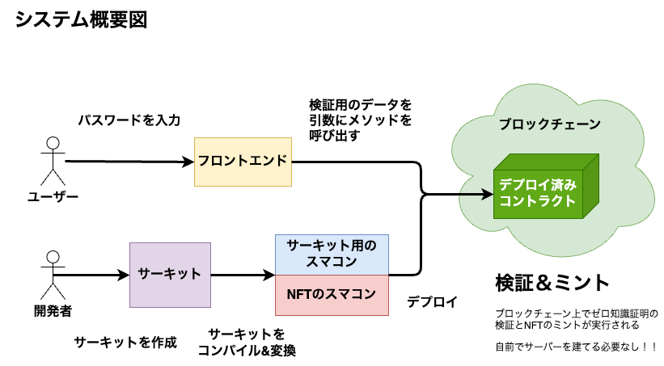
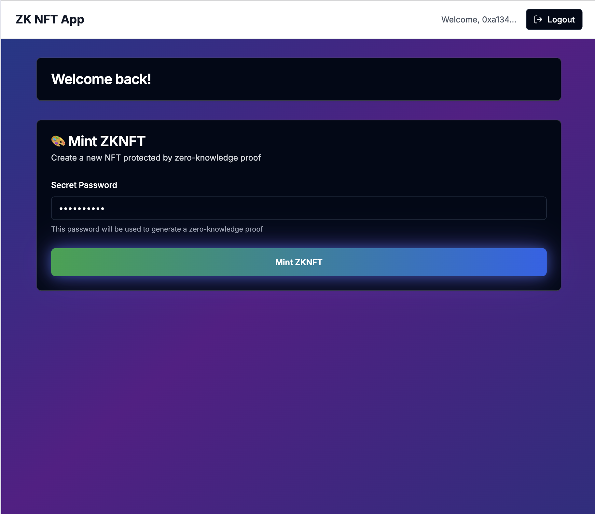

# ブロックチェーンとゼロ知識証明で作るフルスタックサーバーレスアプリケーション

## システム構成図



## アプリの画面イメージ



## 動かす時の注意事項

パスワードを変える時はサーキットのコンパイルからやり直すこと！

## 動かし方

- インストール

  ```bash
  pnpm i
  ```

  - `circuit`側

    - コンパイル

      ```bash
      pnpm circuit run compile
      ```

    - Inputデータを生成する。

      `pkgs/circuit/scripts/generateInput.js` ファイルの7行目の部分は自分の設定したい好きなパスワードを指定すること

      ```ts
      const input = "serverless";
      ```

      設定したら以下のコマンドを実行

      ```bash
      pnpm circuit run generateInput
      ```

      生成された値のうち、 `inputNumber` と `hash` を `pkgs/circuit/data/input.json`に貼り付ける

    - verify 用の solidity ファイルなどを生成する

      ```bash
      pnpm circuit run executeGroth16
      ```

    - witness ファイルを生成する

      ```bash
      pnpm circuit run generateWitness
      ```

    - Proofの生成と検証のテスト

      ```bash
      pnpm circuit run test
      ```

    - verify 用の Solidity ファイルを backend フォルダ配下に移す

      ```bash
      pnpm circuit run cp:verifier
      ```

    - zk 用のファイルを backend と frontend フォルダ配下に移す

      ```bash
      pnpm circuit run cp:zk
      ```

  - `backend`側

    - 環境変数のセットアップ

      `.env`ファイルを作成し、以下の値を設定する

      ```txt
      PRIVATE_KEY=""
      ALCHMEY_API_KEY=""
      BASESCAN_API_KEY=""
      ```

    - コンパイル

      ```bash
      pnpm backend run compile
      ```

    - テスト

      ```bash
      pnpm backend run test
      ```

    - スマートコントラクトのデプロイ

      もしすでにデプロイ済みであれば `--reset` オプションをつけて実行すること
 
      ```bash
      pnpm backend run deploy:ZKNFT --network base-sepolia
      ```

    - スマートコントラクトを verify

      ```bash
      pnpm backend run verify chain-84532 --include-unrelated-contracts
      ```

    - 総発行数を取得する

      ```bash
      pnpm backend run totalSupply --network base-sepolia
      ```

    - NFT をミントする

      ```bash
      pnpm backend run mint --network base-sepolia
      ```

  - `frontend`側

    - 環境変数のセットアップ

      `.env.local`ファイルを作成し、以下の値を設定する

      ```txt
      # Privy Auth Settings
      NEXT_PUBLIC_PRIVY_APP_ID=

      # PASSWORD_HASH Settings
      PASSWORD_HASH=
      ```

    - ビルド

      ```bash
      pnpm frontend run build
      ```

    - フロントエンド起動

      ```bash
      pnpm frontend run dev
      ```

## デプロイ済みのコントラクト情報

## 参考文献
- [Rarible - Testnet](https://testnet.rarible.com/user/0x51908f598a5e0d8f1a3babfa6df76f9704dad072/owned)
- [GitHub - Biconomy Next.js サンプルリポジトリ](https://github.com/bcnmy/examples/tree/main/nextjs-quickstart)